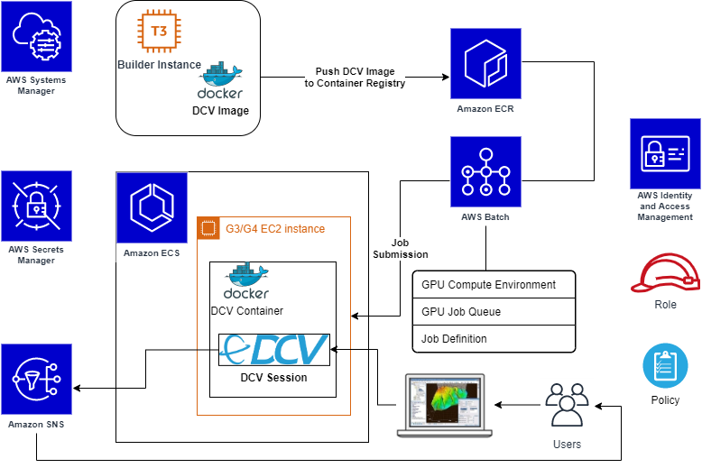

# DCV Install

## Notes
- Use ECS Graphics-optimized EC2 instances
- User credentials and notification information are stored in Secrets Manager
- Each user has their own ECS container
- AWS Batch manages a queue of jobs to load up the user environments (managing EC2 capacity and launching the user's ECS task)
- New images are managed in a separate dedicated instance where we pull the game build, copy it into a new docker build and push the new image to the registry in ECR. 
- Need ports open for DCV traffic.
- 

## TODO

### Containerized DCV
I've almost got the containerized deployment of DCV 
1. Deploy the DCV container builder instance.
2. Set up the Secrets Manager secrets for user credentials and notification data
3. Build the initial image and push it to ECR
4. Set up AWS Batch to deploy capacity and containers on demand.

### Deploy Intraverse
Next we need to drop the actual Intraverse application into the build image, test it and identify any issues that arise from the nuance between the example app and Intraverse.

### Configure Metrics and Logging
We want some initial observability in place so that we can gather data on performance and scaling. This way we can make informed decisions on optimization.

### Testing and Optimization
We will likely need to make adjustments for performance and cost optimization. For example, we need to identify the proper configuration of instance types and number of containers per instance. 

### Build Deployment Automation
When a new build is ready, we want to automate the image build and deployment to the task fleet in the cluster. 

## [How to run 3D interactive applications with NICE DCV in AWS Batch](https://aws.amazon.com/blogs/compute/how-to-run-3d-interactive-applications-with-nice-dcv-in-aws-batch/)

This blog post goes through the following steps:

1. Prepare required components
    - Launch temporary EC2 instance to build a DCV container image
    - Store user’s credentials and notification data
    - Create required roles
2. Build DCV container image
3. Create a repository on Amazon ECR
    - Push the DCV container image
4. Configure AWS Batch
    - Create a managed CE
    - Create a related job queue
    = Create its Job Definition
5. Submit a batch job
6. Connect to the interactive desktop session using NICE DCV
    - Run the Paraview application to visualize results of a job simulation

## Tickets

- Add a script that forces the game to run on gpu (prime run)
- Brand the waiting screen while user and session are created
- 